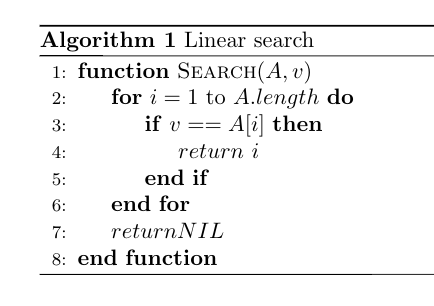

#### 2.1-1
Using Figure 2.2 as a model, illustrate the operation of INSERTION-SORT on the array `[31, 41, 59, 26, 41, 58]`.

|    step    | state |
|--------|-----------|
| 1 | [**31**, 41 , 59, 26, 41, 58] |
| 2 | [**31**, **41**, 59, 26, 41, 58] |
| 3 | [**31**, **41**, **59**, 26, 41, 58] |
| 4 | [**26**, **31**, **41**, **59**, 41, 58] |
| 5 | [**26**, **31**, **41**, **41**, **59**, 58] |
| 6 | [**26**, **31**, **41**, **41**, **58**, **59**] |


#### 2.1-2
Rewrite the INSERTION-SORT procedure to sort into non-increasing instead of non-decreasing order.

```scala
for j = 2 to A.length
  key = A[j]
  i = j - 1
  while i > 0 and A[i] < key
    A[i + 1] = A[i]
    i = i - 1
  A[i + 1] = key
```

#### 2.1-3
Consider the searching problem:
Input: A sequence of `n` numbers `A = [a1, a2, ..., an]` and a value `v`.

Output: An index i such that `v = A[i]` or the special value `NIL` if `v` does not appear in `A`.

Write pseudocode for _**linear search**_, which scans through the sequence, looking for `v`. 
Using a loop invariant, prove that your algorithm is correct. Make sure that your loop invariant fulfills the three necessary properties.



Let us see how three properties of loop invariant hold for linear search algorithm.

**Initialization**: we start by showing that the loop invariant holds before the first loop iteration, when there is no found index of 
given value `v` from given array `A`. 

**Maintenance**: Next, we tackle the second property: showing that each iteration maintains the loop invariant. Informally, the body of 
the **for** loop works by checking each element in sequence of given array `A` until it finds the value by index `i`, such that `v = 
A[i]`. Incrementing `i` by 1 for the next iteration of the **for** loop then preserves the loop invariant with not found index.

**Termination**: Finally, we examine what happens when the loop terminates. There are two conditions causing the **for** loop to terminate:
1. when the value `v` is found by the index `i` in the array `A`. We must have `1 <= i <= A.length` at that time.
2. when the value `v` is not found by the index `i` in the array `A`. We must have `i = A.length + 1` at that time.

Observing that the output of the linear search algorithm is an index `i` such that `v = A[i]` or the special value `NIL` if `v` does not
appear in `A`, we conclude that the algorithm is correct.


#### 2.1-4
Consider the problem of adding two _n_-bit binary integers, stored in two _n_-element arrays `A` and `B`. 
The sum of the two integers should be stored in binary form in an _`(n+1)-element`_ array `C` . 
State the problem formally and write pseudocode for adding the two integers.

**Input**: Two _n_-bit binary integers, stored in two _n_-element arrays `A` and `B`

**Output**: The sum of the two integers stored in binary form in an _`(n+1)-element`_ array `C`

Given below pseudocode for binary addition called **ADD**, which is responsible for adding two binary digits represented in
array data structure. The algorithm creates new array C of n+1 size for holding the result of addition, iterates through A and B from 
least significant bit to the most significant one, adds bits and keeps the carry for the next iteration. 
After adding A and B, the resulting carry bit is stored at C[1].

```scala
function add(A, B)
  C = [A.length+1]
  carry = 0
  for i = A.length to 1 by -1
    C[i]  = (A[i] XOR B[i]) XOR carry
    carry = ((A[i] XOR B[i]) AND carry) OR (A[i] AND B[i])
  C[1]  = carry
  return C
```

#### 2.2-1
Express the function `n^3/1000 - 100*(n^2) - 100n + 3` in terms of O-notation.

`O(n^3)`

#### 2.2-2
Consider sorting n numbers stored in array A by first finding the smallest element of A and exchanging it with the element in A[1]. Then 
find the second smallest element of A, and exchange it with A[2]. Continue in this manner for the first n - 1 elements of A. 
Write pseudocode for this algorithm, which is known as selection sort.

```scala
function selection-sort(A)
  for i = 1 to A.length - 1
    min = i
    for j = i+1 to A.length
      if (A[j] < A[min])
        min = j
    t = A[min]
    A[min] = A[i]
    A[i] = t
  return A
```

What loop invariant does this algorithm maintain?

**Initialization**:
We start by showing that the loop invariant holds after the first loop iteration. As selection sort works by finding the smallest element
from the unsorted part of the array and by exchanging it with the very first element of the unsorted part of the array, after the first 
loop iteration the head of the array contains the smallest element and length of unsorted region is reduced by 1.

**Maintenance**: Next, we tackle the second property: showing that each iteration maintains the loop invariant. On each iteration, the 
algorithm finds the smallest element from the unsorted part of the array and exchanges it with the head of the unsorted part of array. 
After each iteration, the sorted region of the array is increased by 1 and the unsorted region of the array is decreased by 1. It is very
important to mention that each found the smallest element from unsorted part of the array on iteration `i` is always greater or equal to
the element found on iteration `i - 1`, so that property of sorted array holds for the sorted region. 

**Termination**: The selection sort terminates after `A.length - 1` iterations. As each element of the sorted array is less than or equal 
to the next element, the property os sorted array holds. Hence, the algorithm is correct.

Why does it need to run for only the first n - 1 elements, rather than for all n elements?

As selection sort always tries to find the smallest element from the unsorted part of the array, after `A.length - 1` iterations all 
the elements which are smaller than the remaining one have already been found and sorted, so that the remaining one is the greatest. By 
sorting `A.length - 1` elements we have the greatest one at the and of the array for free. That is why selection sort needs to run only 
`A.length - 1` iterations in the outer loop. 

Give the best-case and worst-case running times of selection sort in O-notation.

O(n^2) for the best and worst cases.


#### 2.2-3
Consider linear search again (see Exercise 2.1-3) and justify your answers.
How many elements of the input sequence need to be checked on the average, assuming that the element being searched for is equally likely 
to be any element in the array?

If each element is equally likely to be searched, then linear search has an average case of n/2 comparisons, but the average case can be 
affected if the search probabilities for each element vary.

How about in the worst case?

Linear search runs in a worst linear time and makes at most n comparisons, where n is the length of the list.

What are the average-case and worst-case running times of linear search in O-notation?

Taking into account that n/2 elements are checked on average, asymptotic approximation gives us O(n). 

#### 2.2-4
How can we modify almost any algorithm to have a good best-case running time?

In order to have a good best-case running time for a given algorithm, we need to extend it with a pre-check hook that is responsible for 
input analysis. If input is correlated with desired output, then algorithm enters termination phase of loop invariant 
immediately and expected output is returned by the algorithm.
